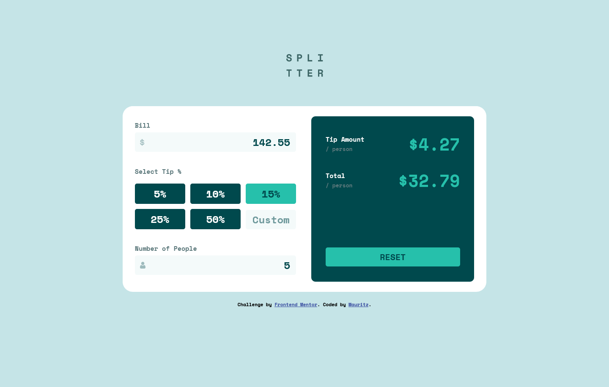

# Frontend Mentor - Tip calculator app solution

This is a solution to the [Tip calculator app challenge on Frontend Mentor](https://www.frontendmentor.io/challenges/tip-calculator-app-ugJNGbJUX). Frontend Mentor challenges help you improve your coding skills by building realistic projects.

## Table of contents

- [Overview](#overview)
  - [The challenge](#the-challenge)
  - [Screenshot](#screenshot)
  - [Links](#links)
- [My process](#my-process)
  - [Built with](#built-with)
  - [What I learned](#what-i-learned)
  - [Continued development](#continued-development)
  - [Useful resources](#useful-resources)
- [Author](#author)


## Overview

### The challenge

Users should be able to:

- View the optimal layout for the app depending on their device's screen size
- See hover states for all interactive elements on the page
- Calculate the correct tip and total cost of the bill per person

### Screenshot


;

### Links

- Solution URL: [solution URL](https://your-solution-url.com)
- Live Site URL: [live site URL](https://mauritzlm.github.io/tip-calculator-app/)

## My process

### Built with

- Semantic HTML5 markup
- CSS custom properties
- Flexbox
- CSS Grid
- Mobile-first workflow

### What I learned

I learned about event delegation. Setting the event listener on a parent element and then using element.matches() with the css selector of the element.
This is very useful if one adds elements to the page dynamically.

```js
document.addEventListener("input", (e) => {
    if (e.target.matches("input[type='number']")) {
      // run function
      }
});
```

### Continued development

I want to continue improving my workflow and writing maintainable code.

### Useful resources

- [event listeners guide](https://blog.webdevsimplified.com/2022-01/event-listeners/) - Guide about events and event delegation.

## Author

- Frontend Mentor - [@MauritzLM](https://www.frontendmentor.io/profile/yourusername)


